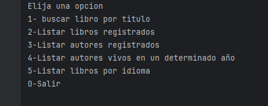

# Literalura
  

## Descripción

La aplicación **Literalura** facilita la gestión de libros y autores en una base de datos. Los usuarios pueden registrar libros, consultar autores de un año específico, buscar libros por idioma y obtener una lista completa de libros registrados. Todo esto se realiza de manera eficiente y organizada, permitiendo una fácil administración de la biblioteca.

## Funcionalidades

1. **Registrar libro**: Permite añadir nuevos libros a la base de datos, con detalles como el título, autor, idioma, y año de publicación.
2. **Listar libros**: Muestra todos los libros registrados en la base de datos.
3. **Listar autores**: Muestra todos los autores registrados, permitiendo una visualización general.
4. **Listar autores por año**: Filtra y muestra autores que publicaron libros en un año específico.
5. **Listar libros por idioma**: Permite filtrar los libros según el idioma en el que están escritos.

## Video de presentación

## Video de presentación

Mira el video de presentación de la aplicación **Literalura**:

[Ver el video](https://drive.google.com/file/d/1-fRDdW1f8rkxC_Ftm-H4iPi4f60alEra/view?usp=sharing)

